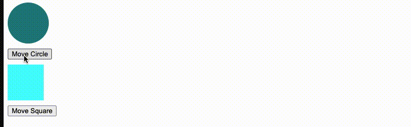
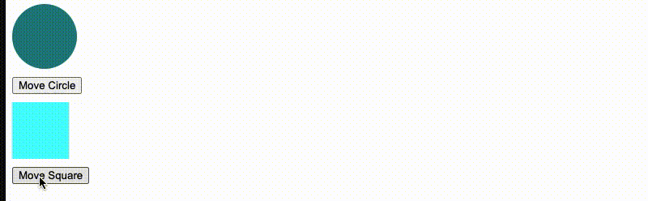

# Animate Right

In this folder, a web page will demonstrate the `animateRight` function which
moves the element `el` to the right by 100px over a duration of 1 second.

## Set up

Run `node app.js` to start the application. Navigate to [localhost:5000](http://localhost:5000) in your browser. There are two elements: `#circle` and `#square`.
Clicking the `Move Circle` button will move the Circle to the right by 100px
with a delay of 1 second.

Likewise, clicking the `Move Square` button will move the Square to the right by 100px with a delay of 1 second.

## `animateRight` Function

The `animateRight` function can be found in `assets/js/manipulate.js`.
